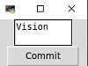

# Where GitHub Projects Located ?!

Search github for projects with a given text and plot the location of the owners on a map.
Check the result [here](https://amin-azar.github.io/gittomap/)

### Steps

1. Opens a window with a TextBox and a Button 
2. Searches the GitHub for repos, then users and then locations (NOTE: there is a rate limit on number of requests with no authentication. For basic authentication, just pass your github username and password in a json file like this {"user":your_username, "pass":your_password} )
3. Gets 3Code for extracted countries (i.e. China -> CHN)
4. Plots and shows that in default browser under for example http://127.0.0.1:60685/

<iframe width="100%" height="300" frameborder="0" scrolling="no" src="res.html" border="0"></iframe>

## Contributing

Please feel free to ask for features or contribute to this project.

