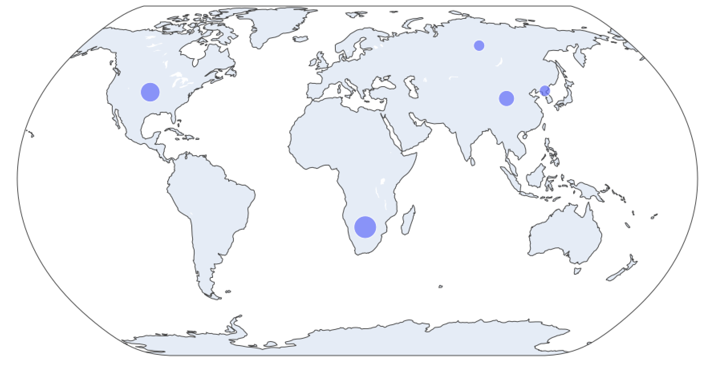

# Where GitHub Projects Located ?!

Search github for projects with a given text and plot the location of the owners on a map.

### Steps

1. Opens a window with a TextBox and a Button 
2. Searches the GitHub for repos, then users and then locations (NOTE: there is a rate limit on number of requests with no authentication)
3. Gets 3Code for extracted countries (i.e. China -> CHN)
4. Plots and shows that in default browser under for example http://127.0.0.1:60685/

## Contributing

Please feel free to ask for features or contribute to this project.

